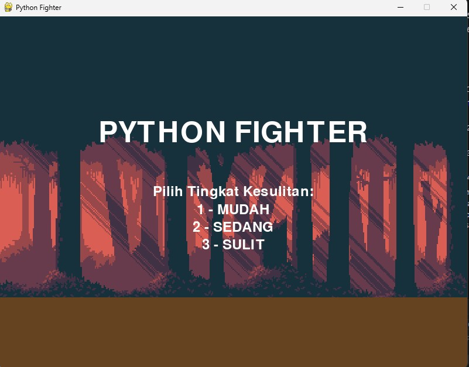
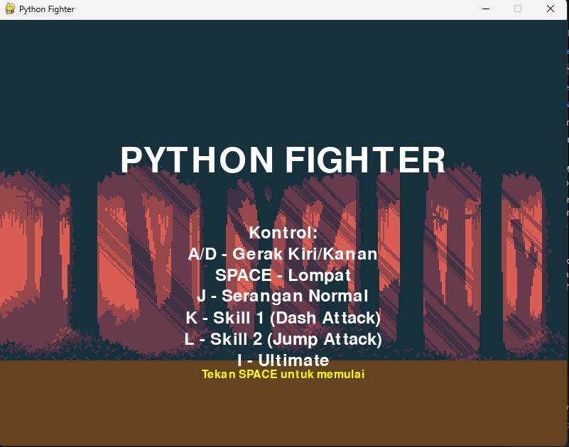
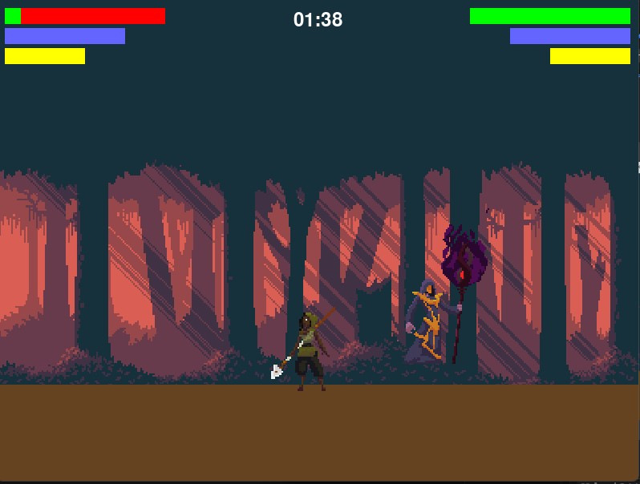

# Python Fighter Arena

Sebuah game fighting 2D yang dibuat menggunakan Pygame, menampilkan pertarungan epik antara Huntress dan Evil Wizard di Demon Woods.

## 📸 Preview Game

### Menu Utama & Pemilihan Tingkat Kesulitan


### Pertarungan In-Game


### Status Bar & UI


## 🎮 Fitur Game

- Pertarungan 1v1 melawan AI dengan 3 tingkat kesulitan
- Sistem pertarungan best of 3 rounds
- Karakter dengan animasi lengkap
- Background parallax yang dinamis
- Sistem skill dan ultimate ability
- Health, Energy, dan Ultimate gauge
- Timer pertandingan
- UI status bar yang informatif

## 🎯 Kontrol

- **A/D** - Gerak Kiri/Kanan
- **SPACE** - Lompat
- **J** - Serangan Normal
- **K** - Skill 1 (Dash Attack)
- **L** - Skill 2 (Jump Attack)
- **I** - Ultimate

## 🛠️ Instalasi

1. Pastikan Python sudah terinstall di sistem Anda
2. Clone repository ini:
```bash
git clone https://github.com/Dwica2004/Gelud-1-vs-bot.git
cd Gelud-1-vs-bot
```

3. Install dependencies yang diperlukan:
```bash
pip install -r requirements.txt
```

4. Jalankan game:
```bash
python main.py
```

## 📋 Persyaratan Sistem

- Python 3.x
- Pygame 2.5.2
- Sistem Operasi: Windows/Linux/MacOS

## 🎨 Asset Credits

- Background: Demon Woods Parallax Pack by David Marah (@aethrall)
- Karakter:
  - Huntress (CC-0)
  - Evil Wizard 2 (CC-0)

## 🤝 Kontribusi

Kontribusi selalu diterima! Jika Anda ingin berkontribusi:

1. Fork repository ini
2. Buat branch baru untuk fitur Anda
3. Commit perubahan Anda
4. Push ke branch
5. Buat Pull Request

## 📝 Lisensi

Proyek ini dilisensikan di bawah MIT License - lihat file [LICENSE](LICENSE) untuk detail.

## 🎯 Rencana Pengembangan Kedepan

- [ ] Menambah karakter baru
- [ ] Mode multiplayer local
- [ ] Sistem combo
- [ ] Lebih banyak stage
- [ ] Efek suara dan musik
- [ ] Sistem ranking 